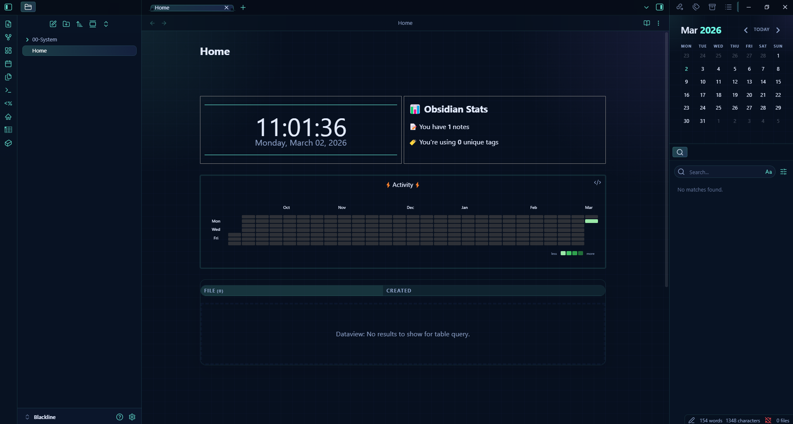
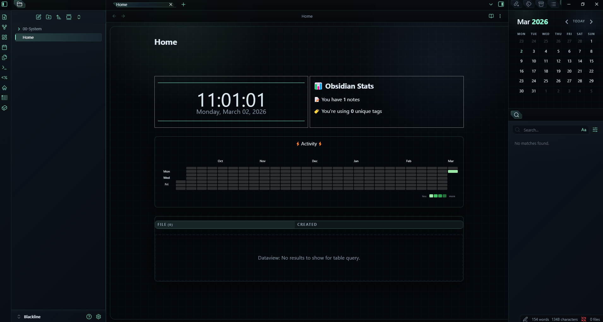
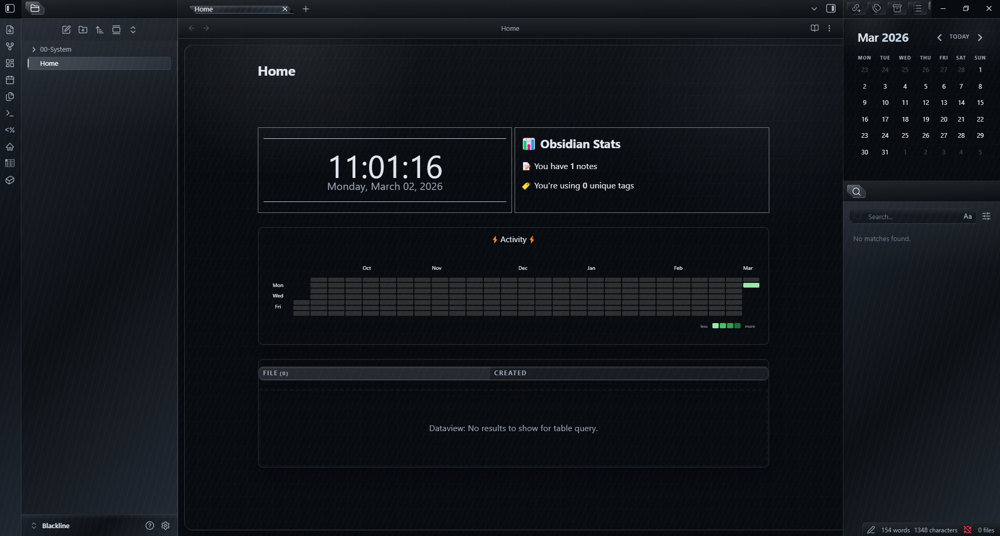

# Astral Command

Futuristic Obsidian theme collection with three distinct variants:
- `Astra Command Blue`
- `Astra Command Green`
- `Astra Command Titanium`

Each variant is packaged as a standalone Obsidian theme inside [`themes/`](./themes).

## Preview

### Astra Command Blue



### Astra Command Green



### Astra Command Titanium



## Variants

| Theme | Version | Focus | Package |
| --- | --- | --- | --- |
| Astra Command Blue | `1.0.0` | clean orbital UI, neon blue/cyan surfaces | [`themes/Astra Command Blue`](./themes/Astra%20Command%20Blue) |
| Astra Command Green | `1.1.0` | bionic tactical interface, sharper geometry | [`themes/Astra Command Green`](./themes/Astra%20Command%20Green) |
| Astra Command Titanium | `1.2.0` | metallic command deck, steel and gunmetal accents | [`themes/Astra Command Titanium`](./themes/Astra%20Command%20Titanium) |

## Installation

### Manual install

1. Open your vault folder.
2. Go to `.obsidian/themes/`.
3. Copy one folder from [`themes/`](./themes) into `.obsidian/themes/`.
4. In Obsidian, go to `Settings -> Appearance -> Themes`.
5. Select the copied theme.

### Theme package contents

Every variant contains:

- `manifest.json`
- `theme.css`

## Repository Structure

```text
Astral Command/
├── assets/
│   └── previews/
├── docs/
├── themes/
│   ├── Astra Command Blue/
│   ├── Astra Command Green/
│   └── Astra Command Titanium/
├── CHANGELOG.md
├── LICENSE
└── README.md
```

## License

Released under the [MIT License](./LICENSE).

## ☕ Coffee for me 

I have converted coffee into this repository. If you think it was worth it, consider helping me buy more coffee: <a href="https://www.paypal.com/paypalme/llzektorll"> PayPal </a>
